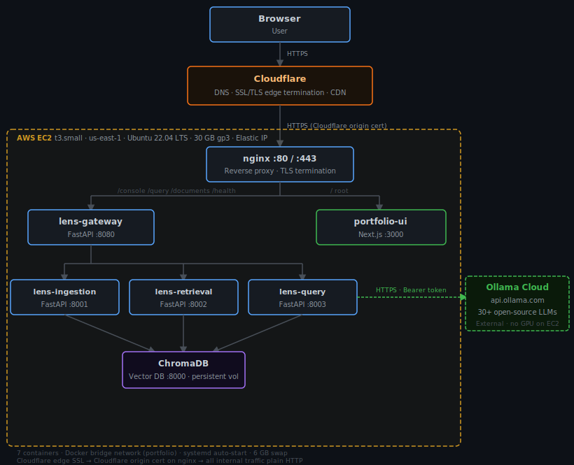

# Architecture

## Traffic path

1. **User browser** sends an HTTPS request to `agentlens.adityonugroho.com`.
2. **Cloudflare** resolves the DNS, terminates the browser-facing TLS session, applies CDN caching (static assets), and forwards the request to the EC2 Elastic IP over a second HTTPS connection authenticated by a Cloudflare-issued origin certificate.
3. **nginx** (Docker container) receives the request on port 443, verifies the origin certificate, and routes by path prefix:
   - `/console`, `/query`, `/documents`, `/models`, `/config`, `/health` → `lens-gateway:8080`
   - `/` (everything else) → `portfolio-ui:3000`
   Port 80 accepts requests only to issue a permanent redirect to HTTPS.
4. **lens-gateway** (FastAPI :8080) routes to the appropriate downstream service, caches the Ollama model list (1-hour TTL), and serves the pipeline debugger HTML at `/console`.
5. For a query, **lens-query** (FastAPI :8003) runs the multi-agent pipeline: Retrieval Agent → Grader → Quality Judge, with a retry loop and Fallback on failure. It calls the Ollama Cloud API for every LLM inference step.
6. **lens-retrieval** (FastAPI :8002) executes vector search (ChromaDB cosine) and BM25 keyword search against the indexed document corpus.
7. **lens-ingestion** (FastAPI :8001) handles document uploads, chunking (512-word, 50-word overlap), embedding (all-MiniLM-L6-v2), and PII detection before writing to ChromaDB.
8. **ChromaDB** (port 8000) stores document embeddings on a persistent Docker volume. All services reach it via Docker internal DNS.
9. The response streams back through the chain as NDJSON (Server-Sent Events) so the debugger UI can render agent steps in real time.

---

## Component breakdown

| Component | Container | Responsibility |
|-----------|-----------|---------------|
| nginx | `nginx` | TLS termination, path-based routing, HTTP→HTTPS redirect |
| API Gateway | `lens-gateway` | Request routing, model list caching, debugger UI serving |
| Query | `lens-query` | Multi-agent orchestrator, ReAct loop, Grader, Quality Judge, Fallback |
| Retrieval | `lens-retrieval` | Vector search (ChromaDB cosine) + BM25 keyword search |
| Ingestion | `lens-ingestion` | Document parsing (PDF/TXT/DOCX), chunking, embedding, PII detection |
| ChromaDB | `chromadb` | HNSW vector index (384-dim), persistent volume |
| Portfolio UI | `portfolio-ui` | Next.js frontend (documentation site and homepage) |
| Ollama Cloud | external | LLM inference — 30+ open-source models, no GPU required on EC2 |

---

## Data flow for a single RAG query

```
POST /query/stream
     │
     ▼
lens-gateway  ──► lens-query
                      │
                      ▼
              Query Classification (heuristic, zero-LLM)
                      │
              ┌───────┴──────────────────────┐
              │ Retrieval path                │ Direct path
              ▼                              ▼
       Orchestrator (max 2 rounds)     Fallback LLM call
              │                        (Ollama Cloud API)
       Round N:
         1. Retrieval Agent (ReAct, 1–5 tool calls)
              │ vector_search / keyword_search
              ▼
            lens-retrieval ──► ChromaDB
              │
         2. Grader (score each chunk 1–5, filter ≤ 1)
              │ Ollama Cloud API
              ▼
         3. Quality Judge (ACCEPT or RETRY + feedback)
              │ Ollama Cloud API
              ▼
         ACCEPT → answer + confidence + reasoning trace
         RETRY  → feedback → Round N+1 (max 2 rounds)
              │
              ▼
       NDJSON stream → lens-gateway → nginx → Cloudflare → Browser
```

**LLM call budget:** 2–3 calls in the common case (one retrieval round + grader + judge ACCEPT). Worst case: 7 calls across 2 retrieval rounds, 2 grader calls, 2 judge calls, and fallback.

**Per-role model assignment:**

| Role | Default model | Size | Purpose |
|------|--------------|------|---------|
| Retrieval Agent | `devstral-small-2:24b` | 24B | ReAct tool-use planning (1–5 iterations) |
| Grader | `nemotron-3-nano:30b` | 30B | Chunk relevance scoring (1–5 scale) |
| Quality Judge | `gpt-oss:120b` | 117B | Answer generation + ACCEPT/RETRY verdict |
| Fallback | `gemini-3-flash-preview` | Cloud | Direct LLM answer when judge defers |

Models are overridable per-request (UI dropdowns) or per-deployment (environment variables).

---

## Scaling considerations and single-instance rationale

The current deployment is intentionally a single EC2 t3.small. This is the right choice for this workload:

- **Traffic:** A portfolio/demo application with modest concurrent users. No horizontal scaling pressure.
- **Stateful services:** ChromaDB runs on the same instance with a persistent volume. Splitting it off (e.g., to a managed vector DB or a separate EC2) would add operational complexity and cost without benefit at this scale.
- **LLM inference is offloaded:** All model inference goes to the Ollama Cloud API. The EC2 instance does no GPU work and is never the inference bottleneck.
- **Memory:** t3.small has 2 GB RAM. The three Python services plus ChromaDB and nginx fit comfortably; 6 GB of swap (3 swap files) protects against OOM spikes from the sentence-transformers embedding model (~600 MB resident) during image build.
- **Cost:** ~$26/month (t3.small + 30 GB gp3 + Elastic IP). Appropriate for a personal portfolio deployment.

At 10× scale, the right move is ECS Fargate for the stateless services (gateway, query, retrieval) with an RDS or managed vector DB for persistence. See [docs/learnings.md](docs/learnings.md) for the full analysis.

---

## Security boundaries

| Boundary | Detail |
|----------|--------|
| Public surface | Port 443 only (nginx). Port 80 redirects to 443. |
| SSH | Port 22 open to 0.0.0.0/0 in the security group (acceptable for a personal portfolio; restrict to your IP in production). |
| SSL termination | Cloudflare terminates browser TLS. The EC2→Cloudflare leg uses a Cloudflare-issued origin certificate on nginx, preventing plain-HTTP origin pull. |
| Internal traffic | All container-to-container communication is plain HTTP on the `portfolio` Docker bridge network. No external exposure — only nginx ports 80/443 are bound to the host. |
| Secrets | Ollama API key and GitHub PAT are injected by Terraform `templatefile()` into the EC2 user-data script at provision time. They are never stored in this repository. |
| SSL key material | Cloudflare origin certs are uploaded to the EC2 by `deploy.sh` at deploy time and stored at `/etc/ssl/cloudflare/`. They are never committed to any repo. |
| ChromaDB | Bound to the Docker bridge network only. Not exposed to the host or the internet. |

---

## Diagram


