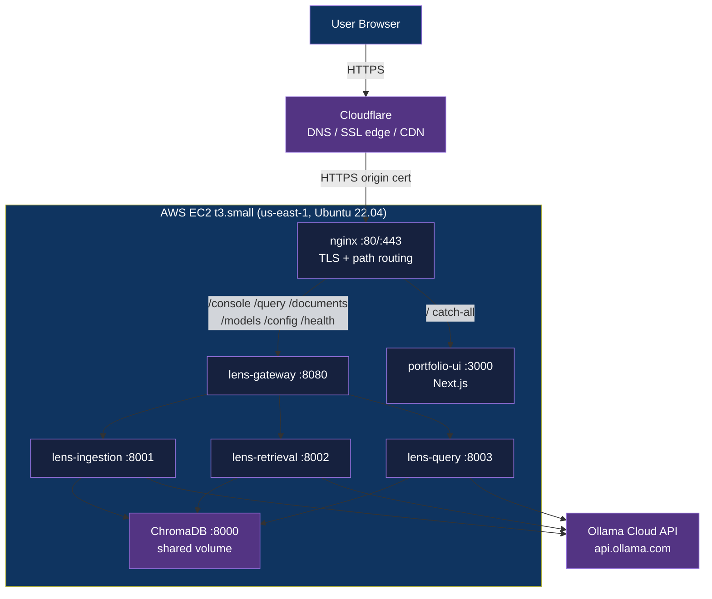

<div align="center">

# AgentLens on AWS: Infrastructure-as-Code

[](https://www.terraform.io/)
[](https://docs.docker.com/compose/)
[](LICENSE)

**AWS infrastructure-as-code for AgentLens: Terraform, Docker Compose, nginx, and Cloudflare on a single EC2 instance**

[Getting Started](#getting-started) | [Usage](#usage) | [Architecture](#architecture)

</div>

---

## Table of Contents

- [Features](#features)
- [Tech Stack](#tech-stack)
- [Architecture](#architecture)
- [Demo](#demo)
- [Getting Started](#getting-started)
  - [Prerequisites](#prerequisites)
  - [Configuration](#configuration)
- [Usage](#usage)
- [How It Works](#how-it-works)
- [Architectural Decisions](#architectural-decisions)
- [Project Structure](#project-structure)
- [Deployment](#deployment)
- [Known Issues](#known-issues)
- [Security](#security)
- [License](#license)
- [Author](#author)

## Features

AgentLens is a streaming pipeline debugger for multi-agent RAG systems. It coordinates four roles (Retrieval Agent, Grader, Quality Judge, Fallback) across a 4-service FastAPI microservice stack, deployed to production on AWS. This repository holds the infrastructure-as-code and deployment configuration only. The application source is private; an infrastructure reviewer can use this repo to verify the deployment architecture without app-repo access.

- **Single-instance AWS deployment**: Terraform provisions a VPC, subnet, security group, EC2 (t3.small), and Elastic IP in `us-east-1`.
- **7-container Docker Compose stack**: three stacks (shared, agentlens, portfolio) on a user-defined bridge network, started by a systemd unit on boot.
- **Path-based nginx routing**: a single nginx container terminates TLS and splits traffic between `lens-gateway` (AgentLens API) and the Next.js portfolio UI.
- **Cloudflare edge**: DNS, browser-facing TLS termination, CDN, and DDoS protection, with an origin certificate securing the EC2 leg.
- **Offloaded LLM inference**: all model calls go to the Ollama Cloud API, so the EC2 instance runs no GPU workload.
- **Shared base images**: two prebuilt images (`shared-base`, `shared-ml`) cut total image build time and pre-cache the embedding model.
- **One-command deploy and teardown**: `scripts/deploy.sh`, `scripts/update.sh`, and `scripts/teardown.sh` drive the full lifecycle over SSH.

## Tech Stack

| Component | Technology |
|-----------|------------|
| Cloud | AWS EC2 (t3.small), Elastic IP, VPC, security groups |
| IaC | Terraform (hashicorp/aws ~> 5.0) |
| Containers | Docker, Docker Compose plugin |
| Orchestration | 7-container stack on a user-defined Docker bridge network |
| Reverse proxy | nginx (Alpine Docker image) |
| DNS + SSL | Cloudflare edge SSL termination, origin certificates on nginx |
| LLM inference | Ollama Cloud API (api.ollama.com), no GPU on EC2 |
| Vector database | ChromaDB (HNSW cosine, 384-dim, persistent Docker volume) |
| Application | Python 3.12, FastAPI, uvicorn (4 microservices) |
| Frontend | Next.js (portfolio UI, served via catch-all) |
| Embedding model | all-MiniLM-L6-v2 (sentence-transformers, pre-cached at image build) |
| OS | Ubuntu 22.04 LTS (Jammy) |
| Boot automation | systemd (`portfolio.service`, Type=oneshot) |

## Architecture



See [ARCHITECTURE.md](ARCHITECTURE.md) for the full traffic path, component breakdown, and per-query data flow. The topology diagram is at [diagrams/architecture.svg](diagrams/architecture.svg).

## Demo

Live deployment: [agentlens.adityonugroho.com](https://agentlens.adityonugroho.com)

The pipeline debugger UI is served at `/console` and renders each agent step (Retrieval Agent, Grader, Quality Judge, Fallback) in real time as the response streams back over NDJSON.

## Getting Started

### Prerequisites

| Requirement | Notes |
|-------------|-------|
| AWS account | IAM user with VPC, EC2, EIP permissions |
| AWS CLI | Configured with `aws configure` or environment variables |
| Terraform >= 1.0 | `terraform version` to verify |
| SSH key pair | ED25519 recommended: `ssh-keygen -t ed25519 -f ~/.ssh/id_ed25519` |
| Ollama Cloud API key | Sign up at [ollama.com](https://ollama.com) |
| GitHub fine-grained PAT | Read-only access to the agentlens and portfolio app repos |
| Cloudflare origin certificate | Issued from the Cloudflare dashboard, SSL/TLS, Origin Server |
| Domain with Cloudflare DNS | An A record pointing your subdomain to the Elastic IP |

### Configuration

```bash
git clone https://github.com/adityonugrohoid/agentlens-infrastructure.git
cd agentlens-infrastructure

# Terraform variables
cp terraform/terraform.tfvars.example terraform/terraform.tfvars
# Edit terraform.tfvars:
#   aws_region       = "us-east-1"
#   instance_type    = "t3.small"
#   ollama_api_key   = "your_key_here"
#   github_pat       = "github_pat_xxxx"
#   allowed_ssh_cidr = ["your.ip.address/32"]  # restrict in production
```

The LLM model assignment is configured via `.env` (see `.env.example`): one default model plus per-role overrides for the Retrieval Agent, Grader, Quality Judge, and Fallback. Secrets (Ollama API key, GitHub PAT) are injected by Terraform into the EC2 user-data script at provision time and are never stored in this repository.

## Usage

The full lifecycle runs from three scripts. Each SSHs into the EC2 instance and drives Docker Compose for the affected stack.

```bash
# Full deploy: terraform apply, upload certs, build images, start all services
./scripts/deploy.sh

# Selective update (git pull + rebuild)
./scripts/update.sh agentlens   # AgentLens app stack
./scripts/update.sh portfolio   # Portfolio UI
./scripts/update.sh deploy      # Reload nginx config
./scripts/update.sh images      # Rebuild shared base images
./scripts/update.sh all         # Update everything

# Stop services + terraform destroy
./scripts/teardown.sh           # type: destroy
```

After deploy, verify the running stack:

```bash
docker ps --format "table {{.Names}}\t{{.Status}}"
# NAMES             STATUS
# lens-gateway      Up X minutes
# lens-query        Up X minutes
# lens-retrieval    Up X minutes
# lens-ingestion    Up X minutes
# portfolio-ui      Up X minutes
# chromadb          Up X minutes
# nginx             Up X minutes

curl https://agentlens.yourdomain.com/health
```

See [docs/deployment-runbook.md](docs/deployment-runbook.md) for the full step-by-step provision, deploy, update, and teardown procedure.

## How It Works

### Traffic path

1. A browser sends HTTPS to the domain. **Cloudflare** resolves DNS, terminates browser TLS, applies CDN caching, and forwards to the EC2 Elastic IP over a second HTTPS connection authenticated by a Cloudflare origin certificate.
2. **nginx** (Docker container, port 443) verifies the origin cert and routes by path prefix: `/console`, `/query`, `/documents`, `/models`, `/config`, `/health` go to `lens-gateway:8080`; everything else (`/`) goes to `portfolio-ui:3000`. Port 80 only issues a permanent redirect to HTTPS.
3. **lens-gateway** (:8080) routes to the downstream service, caches the Ollama model list (1-hour TTL), and serves the debugger HTML at `/console`.
4. For a query, **lens-query** (:8003) runs the multi-agent pipeline: Retrieval Agent, Grader, Quality Judge, with a retry loop and Fallback on failure, calling the Ollama Cloud API for every inference step.
5. **lens-retrieval** (:8002) runs vector search (ChromaDB cosine) and BM25 keyword search. **lens-ingestion** (:8001) handles uploads, chunking, embedding, and PII detection before writing to **ChromaDB** (:8000).
6. The response streams back through the chain as NDJSON so the debugger UI can render agent steps in real time.

### Docker DNS resolution in nginx

nginx resolves upstream names at request time via Docker's embedded DNS (`resolver 127.0.0.11 valid=30s`) with upstream addresses assigned to variables (`set $upstream_gw lens-gateway`). This lets services start in any order without nginx crashing on a missing container name.

## Architectural Decisions

### 1. Single EC2 instance instead of ECS, EKS, or Fargate

**Decision:** One t3.small EC2 instance with Docker Compose.

**Reasoning:** The workload is a portfolio/demo with modest traffic and all LLM inference offloaded to Ollama Cloud. A container orchestrator adds task definitions, service discovery, and IAM complexity that buy nothing at this scale. Cross-reboot persistence is handled by a `portfolio.service` systemd unit; vertical scaling is a one-line change in `terraform.tfvars`.

### 2. Cloudflare instead of CloudFront or ALB

**Decision:** Cloudflare Free tier for DNS, edge SSL termination, CDN, and DDoS protection.

**Reasoning:** Cloudflare covers DNS, origin certificates, TLS, and CDN at zero marginal cost. An ALB costs ~$16/month before any requests and excludes DNS and DDoS protection. The EC2 leg is protected by a Cloudflare origin certificate (Full SSL strict mode).

### 3. Shared Docker base images

**Decision:** Two base images (`shared-base`, `shared-ml`) built once before any service image.

**Reasoning:** Five Python services share the same core dependencies. Building shared bases once cut total image build time from ~20 minutes to ~6 minutes and avoids 5x duplicate downloads and disk usage. The ML base pre-caches the all-MiniLM-L6-v2 embedding model at build time so containers start with no model download.

### 4. nginx as a Docker container

**Decision:** Run nginx as `nginx:alpine` inside Docker, host nginx removed at boot.

**Reasoning:** Keeping nginx on the same Docker network lets it resolve container names via Docker's embedded DNS, avoiding host port mapping for every service. The `user-data.sh` bootstrap removes host nginx to prevent port conflicts.

See [docs/design-decisions.md](docs/design-decisions.md) for the full set, including Terraform over CloudFormation/CDK and the parametrized service Dockerfile.

## Project Structure

```
agentlens-infrastructure/
├── terraform/
│   ├── main.tf                   # VPC, subnet, SG, EC2, EIP, key pair
│   ├── variables.tf              # Input variables
│   ├── outputs.tf                # Public IP, SSH command, app URL
│   ├── user-data.sh              # EC2 bootstrap (Docker, git clone, systemd)
│   └── terraform.tfvars.example  # Configuration template
├── docker/
│   ├── Dockerfile.base           # Python 3.12-slim + FastAPI + core libs
│   ├── Dockerfile.ml             # + sentence-transformers + all-MiniLM-L6-v2
│   ├── Dockerfile.svc            # Parametrized service builder (SERVICE build arg)
│   ├── Dockerfile.gateway        # Gateway builder (also copies debugger HTML)
│   └── Dockerfile.ui             # Next.js 4-stage build (node:20-alpine)
├── compose/
│   ├── shared.yaml               # ChromaDB + nginx (shared by all apps)
│   ├── agentlens.yaml            # AgentLens stack (4 containers)
│   └── portfolio.yaml            # Portfolio UI (1 container)
├── nginx/
│   ├── nginx.conf                # Main config (gzip, 50 MB body, auto workers)
│   └── conf.d/agentlens.conf     # Virtual host: route split by path prefix
├── scripts/
│   ├── deploy.sh                 # Full deploy: terraform + images + services
│   ├── update.sh                 # Selective update (git pull + rebuild)
│   └── teardown.sh               # Stop services + terraform destroy
├── diagrams/
│   └── architecture.svg          # Architecture diagram
├── docs/
│   ├── deployment-runbook.md     # Step-by-step deploy and teardown
│   ├── design-decisions.md       # Why EC2 over ECS, Cloudflare over ALB, etc.
│   └── learnings.md              # Retrospective and scale considerations
├── .env.example                  # LLM config template
└── LICENSE                       # MIT
```

## Deployment

Provision and deploy are split across Terraform and the deploy script:

1. `terraform init && terraform plan && terraform apply` creates the VPC, internet gateway, public subnet, route table, security group, key pair, EC2 instance, and Elastic IP. First boot runs `user-data.sh` (3-5 minutes) to install Docker, create swap, clone the app repos, and register the systemd service.
2. Upload the Cloudflare origin certificate to `/etc/ssl/cloudflare/` (or let `deploy.sh` do it).
3. In Cloudflare, add a proxied A record pointing the subdomain to the Elastic IP and set SSL/TLS to Full (strict).
4. The `portfolio.service` systemd unit creates the bridge network, builds `shared-base` and `shared-ml`, then starts the shared, agentlens, and portfolio compose stacks.

Run `scripts/deploy.sh` to chain all of this in one command. Full procedure in [docs/deployment-runbook.md](docs/deployment-runbook.md).

## Known Issues

| Issue | Impact | Workaround |
|-------|--------|------------|
| t3.small has 2 GB RAM; the ML image build peaks ~2.5 GB | Medium: OOM risk during first build | 6 GB swap (3 swap files) created at boot; verify with `swapon --show` |
| Synchronous ingestion in an HTTP request | Medium: large batches hit nginx `proxy_read_timeout` (300s) | Ingest in smaller batches; an async worker queue is the scale fix |
| No HA or replication for single-node ChromaDB | High at scale: the persistent volume is a single point of data loss | Re-ingest if the `chromadb_data` volume is lost; managed vector DB at 10x scale |
| SSH (port 22) open to `0.0.0.0/0` by default | Low for a personal deployment | Set `allowed_ssh_cidr` to your IP in `terraform.tfvars` for production |

See [docs/learnings.md](docs/learnings.md) for the full retrospective and the 10x-scale decomposition.

## Security

- **Public surface**: only port 443 (nginx) is exposed; port 80 redirects to 443. ChromaDB and all service ports stay on the Docker bridge network, never bound to the host.
- **TLS**: Cloudflare terminates browser TLS; the EC2 leg uses a Cloudflare origin certificate, preventing plain-HTTP origin pulls.
- **Secrets**: the Ollama API key and GitHub PAT are injected by Terraform `templatefile()` into EC2 user-data at provision time, never committed. SSL key material is uploaded at deploy time to `/etc/ssl/cloudflare/` and is gitignored.
- **No app-level auth**: the AgentLens API endpoints are publicly reachable behind Cloudflare; this deployment is a demo, not a multi-tenant production service.

## License

This project is licensed under the [MIT License](LICENSE).

## Author

**Adityo Nugroho** ([@adityonugrohoid](https://github.com/adityonugrohoid))
